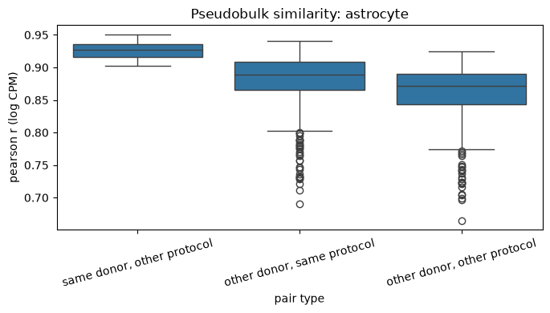

# Same-donor, cross-protocol replicates in SEA-AD - Proof of concept (POC)

Exploratory analysis supporting the PhD proposal *"Learning protocol-invariant single-cell representations from same-donor replicates"*. No models are trained.

## Question

Do open single-nucleus RNA-seq data contain donors measured with **two protocols**, and is a donor's cell-type profile more similar to **itself in the other protocol** than to **other donors**?

If yes, cross-protocol replicates can serve as a label-free ground truth for technical variation: the biology is fixed, only the protocol differs.

## Data

- **Source:** [SEA-AD](https://portal.brain-map.org/explore/seattle-alzheimers-disease) (Seattle Alzheimer's Disease Brain Cell Atlas), open access, via the [CELLxGENE Census](https://chanzuckerberg.github.io/cellxgene-census/).
- **Census version:** `2025-11-08` (the "stable" release at the time of analysis).
- **Region:** middle temporal gyrus (MTG).
- **Protocols (assays):** 10x 3′ v3 (singleome) and 10x multiome (RNA part only).
- **Dataset used for counts:** *Astrocyte – MTG: Seattle Alzheimer's Disease Atlas* (`5097d77d-08fa-4105-a18f-4072d61522a4`, 70,009 nuclei, ~1.1 GB).

Note: SEA-AD cells appear in several Census datasets (whole-taxonomy atlas plus per-cell-type subsets), so raw Census counts are duplicated. The analysis uses a single cell-type dataset, which contains each nucleus once.

## Method

1. **Find matched donors (metadata only).** Query cell metadata for all SEA-AD datasets and count MTG donors with cells from both protocols → **28 donors**.
2. **Load astrocytes** for those donors from the Astrocyte–MTG dataset (raw counts), subsampling up to 100 nuclei per donor × protocol.
3. **Pseudobulk.** Sum raw counts per donor × protocol, normalise to counts per million (CPM), keep genes with CPM > 10 in more than half of the pseudobulks (9,451 genes), log-transform.
4. **Similarity.** Pearson correlation between all pairs of pseudobulks, grouped into three pair types. Groups with fewer than 50 nuclei are excluded, leaving **23 donors**.

## Results

| Pair type | Pairs | Median r |
| --- | --- | --- |
| Same donor, other protocol | 23 | 0.93 |
| Other donor, same protocol | 506 | 0.89 |
| Other donor, other protocol | 506 | 0.87 |




- **Donor identity survives the protocol change:** every same-donor pair (minimum r = 0.90) is more similar than the median pair of different donors measured with the same protocol.
- **A consistent protocol effect exists:** different donors are less similar across protocols (0.87) than within one protocol (0.89).

Cross-protocol replicates are therefore valid positive pairs, and there is a technical effect to remove.


## How to run

```bash
pip install cellxgene-census anndata scanpy pandas numpy scipy matplotlib seaborn
jupyter notebook seaad_replicate_poc.ipynb
```

- Requires internet access. The metadata query takes a few minutes; the dataset download (~1.1 GB) is done once and saved locally as `seaad_astro.h5ad`.
- The filtered, subsampled data are saved as `seaad_astro_matched.h5ad`, so later runs can start from the pseudobulk step.

## References

- Gabitto, M. I. *et al.* Integrated multimodal cell atlas of Alzheimer's disease. *Nature Neuroscience* (2024).
- CZ CELLxGENE Census: https://chanzuckerberg.github.io/cellxgene-census/
